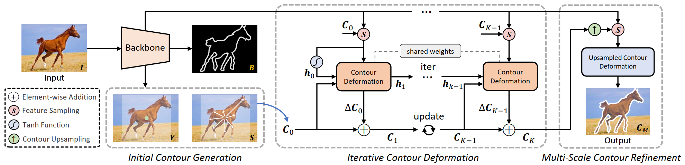

# PolySnake



> [Recurrent Contour-based Instance Segmentation with Progressive Learning](https://arxiv.org/pdf/2301.08898.pdf)  

Any questions or discussions are welcomed!

## Installation

Please see [INSTALL.md](INSTALL.md).

## Testing

### Testing on Cityscapes

1. Download the pretrained model [here](https://drive.google.com/drive/folders/16d-DtL3KKmu5u10uzbH_xg8oInrk0bSZ?usp=share_link) and put it to `$ROOT/data/model/rcnn_snake/cityscapes/`.
2. Test:
    ```
    # use coco evaluator
    python run.py --type evaluate --cfg_file configs/city_snake.yaml
    # use the cityscapes official evaluator
    python run.py --type evaluate --cfg_file configs/city_snake.yaml test.dataset CityscapesVal
    ```
3. Speed:
    ```
    python run.py --type network --cfg_file configs/city_snake.yaml
    ```

### Testing on Kins

1. Download the pretrained model [here](https://drive.google.com/drive/folders/1SnYArybb5-JZxfSA6bavjio228WU5ATA?usp=share_link) and put it to `$ROOT/data/model/snake/kins/`.
2. Test:
    ```
    python run.py --type evaluate --cfg_file configs/kins_snake.yaml test.dataset KinsVal
    ```
3. Speed:
    ```
    python run.py --type network --cfg_file configs/kins_snake.yaml test.dataset KinsVal
    ```

### Testing on Sbd

1. Download the pretrained model [here](https://drive.google.com/drive/folders/1afn5UJPrNiPpZjcHLAGiizlN8MihW_dY?usp=share_link) and put it to `$ROOT/data/model/snake/sbd/`.
2. Test:
    ```
    python run.py --type evaluate --cfg_file configs/sbd_snake.yaml test.dataset SbdVal
    ```
3. Speed:
    ```
    python run.py --type network --cfg_file configs/sbd_snake.yaml test.dataset SbdVal
    ```

### Testing on COCO

1. Download the pretrained model [here](https://drive.google.com/drive/folders/1JrRHyoXUU2JT1Zv6zPhdMDeNAjBqiyEE?usp=share_link) and put it to `$ROOT/data/model/snake/coco/`.
2. Test:
    ```
    python run.py --type evaluate --cfg_file configs/coco_snake.yaml test.dataset CocoVal
    ```
3. Speed:
    ```
    python run.py --type network --cfg_file configs/coco_snake.yaml test.dataset CocoVal
    ```


### Demo

We support demo for image and image folder using `python run.py --type demo --cfg_file /path/to/yaml_file demo_path /path/to/image ct_score 0.3`.

For example:

```
python run.py --type demo --cfg_file configs/sbd_snake.yaml demo_path demo_images ct_score 0.3
# or
python run.py --type demo --cfg_file configs/city_snake.yaml demo_path demo_images/munster_000048_000019_leftImg8bit.png ct_score 0.3
```

If setup correctly, the output will be saved at `$ROOT/demo_out/` and look like


## Training

The training parameters can be found in [project_structure.md](project_structure.md).

### Training on Cityscapes

```
python train_net.py --cfg_file configs/city_snake.yaml model rcnn_snake det_model rcnn_det
```

### Training on Kins

```
python train_net.py --cfg_file configs/kins_snake.yaml model kins_snake
```

### Training on Sbd

```
python train_net.py --cfg_file configs/sbd_snake.yaml model sbd_snake
```

### Training on COCO

```
python train_net.py --cfg_file configs/coco_snake.yaml model coco_snake
```


## Citation

If you find this code useful for your research, please use the following BibTeX entry.

```
@inproceedings{PolySnake2023,
  title={Recurrent Contour-based Instance Segmentation with Progressive Learning},
  author={Feng, Hao and Zhou, Wengang and Yin, Yufei and Deng, Jiajun and Sun, Qi and Li, Houqiang},
  booktitle={Arxiv},
  year={2023}
}
```

## Acknowledgement
Our work benefits a lot from [DeepSnake](https://github.com/zju3dv/snake) and [E2EC](https://github.com/zhang-tao-whu/e2ec). Thanks for their wonderful works.
